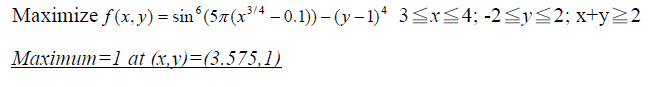
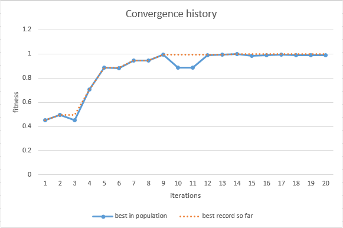

# genetic-algorithm-pratice

<!-- ABOUT THE PROJECT -->
## About The Project
This is a program use Genetic-algorithm to search the global solutions of mathematical case.

## Formula
<!-- PROJECT LOGO -->
<br />
<p align="center">
 
</p>
<br/>

## Prerequisites
* lua
Download Lua For Windows installer from [GitHub](http://github.com/rjpcomputing/luaforwindows/releases)

## Installation

1. Clone the repo 
```sh
git clone https://github.com/EasternGD/genetic-algorithm-pratice
```
2. Generate the result 
```sh
lua main.lua
```
<!-- CONTACT -->

## Result
The optimal solution x: 3.575 y: 0.991 fitness: 0.999
<br />
<p align="center">
 
</p>
<br/>

## Contact

Abbey, Chen - encoref9241@gmail.com

Project Link: [https://github.com/EasternGD/genetic-algorithm-pratice](https://github.com/EasternGD/genetic-algorithm-pratice)
